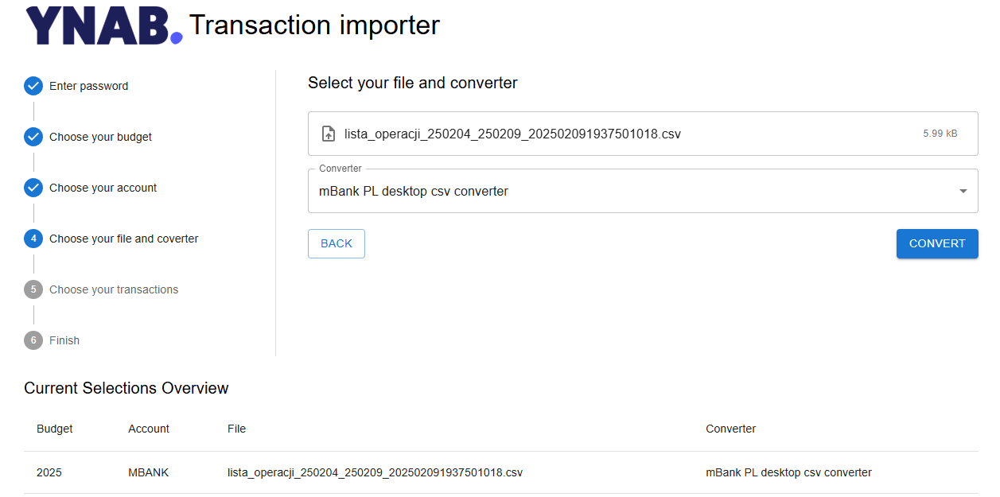

# YNAB Importer

This is a transaction importer for [YNAB](ynab.com) with custom converters.
I created it due to YNAB's lack of support for my bank since YNAB changed its direct import provider to Plaid.
Use it on your own risk.

## Usage (as an app hosted on Vercel)
1. Go to [Vercel](https://vercel.com) and create an account if you don't have one.
2. In "Import Git Repository", click "Import Third-Party Git Repository".
3. Enter this URL https://github.com/xBartosh/ynab-importer.git
4. When asked, login to your Github/Bitbucket account (or create one).
5. Follow the instructions in Vercel.
6. Go to project settings and choose "Environment Variables" on the left.
7. Set your environment variables as below

|key| value                                                    |
|---|----------------------------------------------------------|
|VITE_PASSWORD| your password to this app (so nobody else can access it) |
|VITE_YNAB_API_KEY| your YNAB API key [How to get YNAB API key](https://api.ynab.com/#personal-access-tokens)|

8. Click on the link to the app provided by Vercel.
9. Done! Start using your app by following the in-app form. 

## Currently supported Banks
- MBank (PL) CSV generated by mobile app
- MBank (PL) CSV generated by web app

## Contribution
Feel free to contribute by adding more converters, reporting or fixing bugs.

### How to add a new converter
1. Create a new converter in `src/service/converters` directory.
2. Add a new converter in `src/service/TransactionConverter.ts` file.
